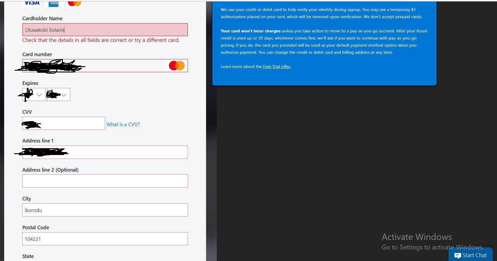
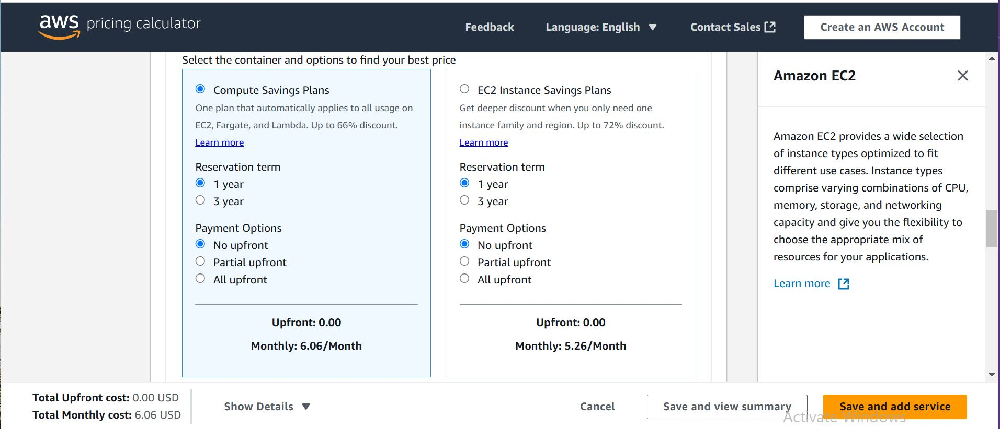
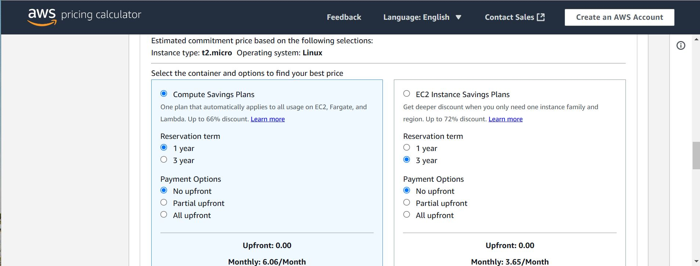
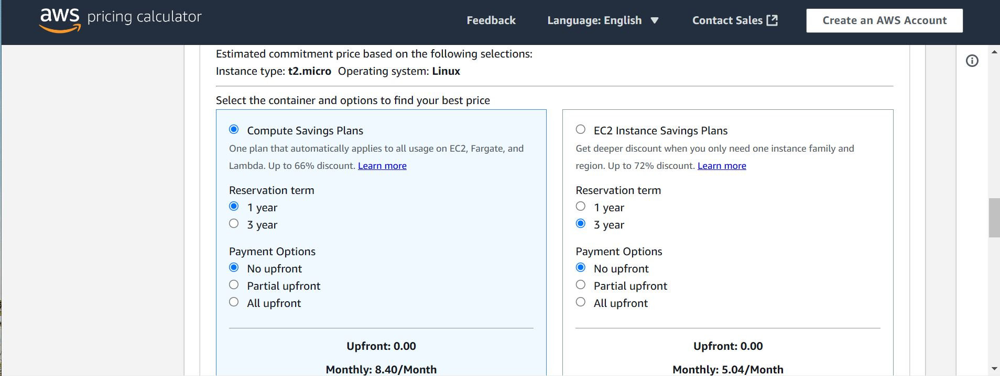
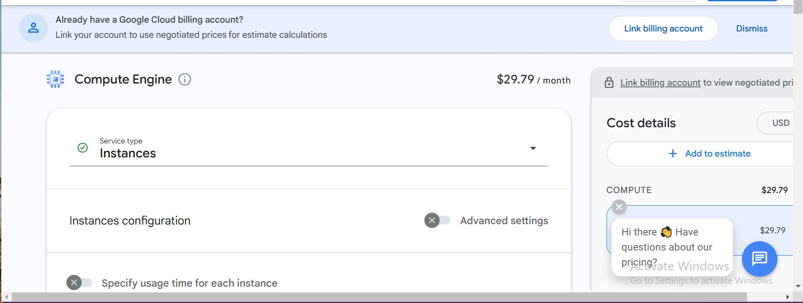
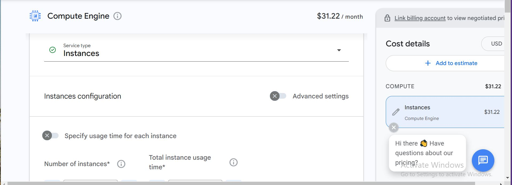
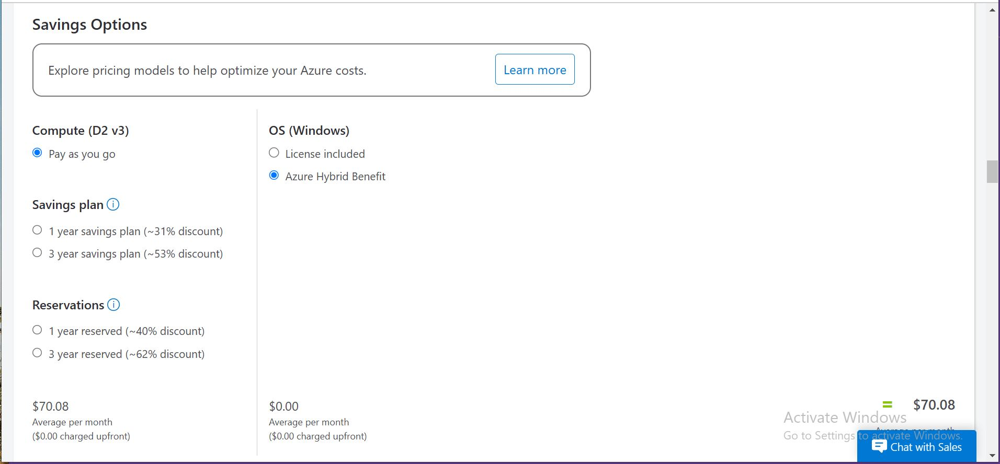
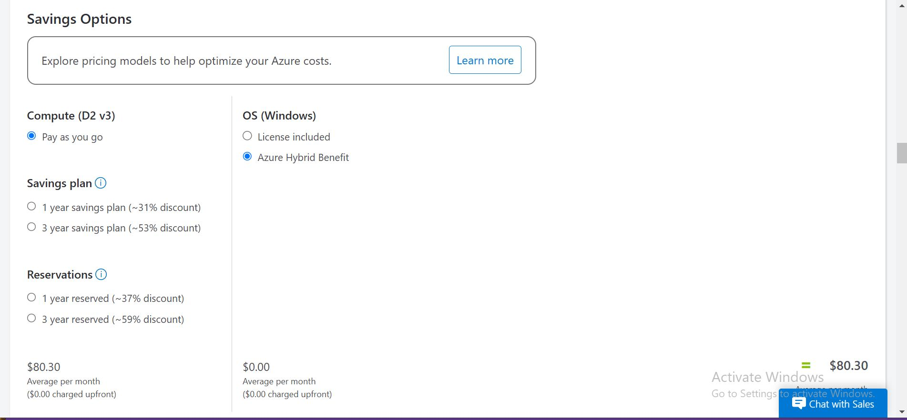

# Introduction to Cloud Computing Assignment

**1. Create a free-tier account on a cloud provider (AWS, GCP, or Azure).**
I was able to open a free-tier account on AWS with my details. but one challenge i encountered was the verification code AWS suppose to send to my contact did not come during the time of openning the account.

I was unable to open a free-tier account on GCP and Azure. I encountered error messages after inputting my details. 

**2. Compare pricing for a service across different regions.**

**For AWS:**
I used the pricing calculator to compare the price of AWS EC2 across three Regions, US East(Virginia), US East(Ohio), US West(California) respectively with following configuration both for compute savings plans and EC2 Instance savings plans.
EC2: T2micro, 1 vCPUs, Memory (1GIB) and Network Performance (low to moderate).

i. US East(Virginia): For compute savings plans and EC2 Instance savings plans, shows $6.06/month and $5.26/month respectively.

ii. US East(Ohio): For compute savings plans and EC2 Instance savings plans, shows $8.40/month and $5.04/month respectively.

iii. US West(California): For compute savings plans and EC2 Instance savings plans, shows $6.06/month and $5.26/month respectively.

**For GCP:**
I compared the price of GCP compute Engine across two Regions, US-Central 1 (Lowa) and Netherland (Europe-West 4) with the following configurations.
Compute Engine: 1 service type instance, Memory (1GIB), operating system Dual Ubuntu pro, General purpose T2A standard-1.

i.  US-Central 1 (Lowa) shows $28.79/month.

ii. Netherland (Europe-West 4) shows $31.22/Month.

**For Azure:**
I compared the price of compute Engine across two Regions, East US and South Central with the following configurations.
Compute Engine: D2v3 standard type, 8GB Ram 80GB temporary storage.
i. East US shows $70.08/month.

ii. South Central $80.30/month.

